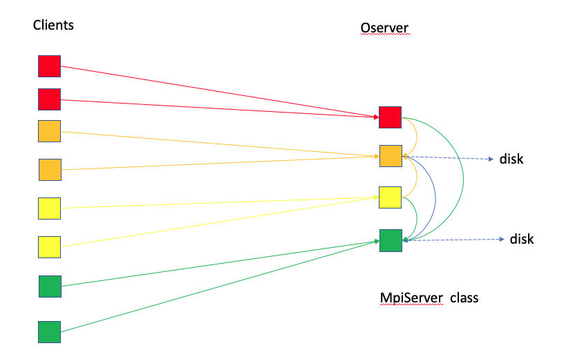
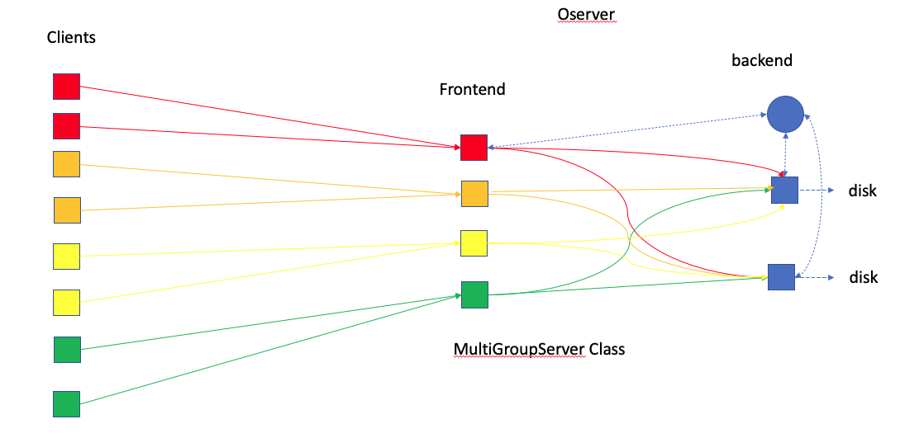
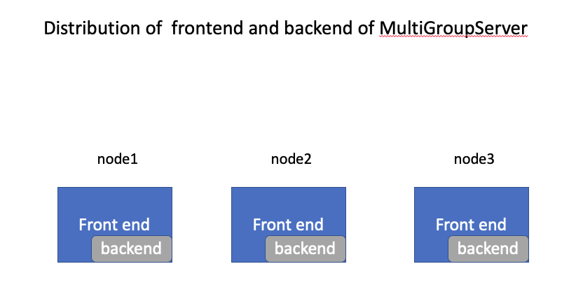

# Content

- [1 Introduction](#1-introduction)
- [2 Types of `Oserver`](#2-types-of--oserver-)
  * [2.1 Simple Server or MpiServer Class](#21-simple-server-or-mpiserver-class)
    + [Command Line](#command-line)
  * [2.2 MultiGroupServer Class](#22-multigroupserver-class)
    + [Command Line](#command-line-1)
      - [`n1` processes for the model and `n2` processes for the `MpiServer`](#-n1--processes-for-the-model-and--n2--processes-for-the--mpiserver-)
      - [`n1` processes for the model and `n2` processes for the `MultiGroupServer`](#-n1--processes-for-the-model-and--n2--processes-for-the--multigroupserver-)
      - [Passing a vector of `oservers`](#passing-a-vector-of--oservers-)
      - [Passing a vector of `oservers` and the `MultiGroupServer`](#passing-a-vector-of--oservers--and-the--multigroupserver-)
      - [`MpiServer` using one-sided `MPI_PUT` and shared memory](#-mpiserver--using-one-sided--mpi-put--and-shared-memory)
      - [Additional Options](#additional-options)
- [3 Profiling Features of PFIO](#3-profiling-features-of-pfio)
- [4 Recommendations](#4-recommendations)
- [5 Exercising PFIO](#5-exercising-pfio)
  * [5.1 PFIO Programming](#51-pfio-programming)
    + [Step 1: Collection Creation](#step-1--collection-creation)
      - [Define Dimensions](#define-dimensions)
      - [Define Dimension Variable](#define-dimension-variable)
      - [Define Variable](#define-variable)
      - [Set File Attribute](#set-file-attribute)
      - [Create File Collection](#create-file-collection)
    + [Step 2: Passing Data to PFIO](#step-2--passing-data-to-pfio)
  * [5.2 Example with a Standalone Code](#52-example-with-a-standalone-code)
  * [5.3 Performance Analysis](#53-performance-analysis)
- [6 Examples of the Implementation of PFIO in non-GEOS Application](#6-examples-of-the-implementation-of-pfio-in-non-geos-application)
  * [6.1 Land Information System](#61-land-information-system)

<small><i><a href='http://ecotrust-canada.github.io/markdown-toc/'>Table of contents generated with markdown-toc</a></i></small>

# 1 Introduction

GEOS-5 related applications (such as `GEOSgcm`, `GEOSctm`, `GEOSldas`, `GCHP`, etc.) produce a lot of output files that consist of several file collections that individually have their own set of fields and are created at different time frequencies (every hour, three  hours, etc.).
As the model resolution increases, the amount of data generated significantly grows, and may become overwhelming for the file system especially if one processor is in charge of reading in or writing out all files.
Running applications on more nodes increases the aggregate memory bandwidth and flops/s but does not necessary improve the I/O performance. 

PFIO, a subcomponent of the [MAPL](https://github.com/GEOS-ESM/MAPL) package, is a parallel I/O tool that was designed to facilitate the production of model netCDF output files (organized in collections) and to efficiently use available resources in a distributed computing environment. 
PFIO asynchronously creates output files therefore allowing the model to proceed with calculations without waiting for the I/O tasks to be completed. 
This allows the applications to achieve achieve higher effective write speeds, and leads to a decrease of the overall model integration time.
The goal of PFIO is for models to spend more time doing calculations instead of waiting on I/O activity. 

Typically, with PFIO, the available nodes (cores) are split into two groups:

- The computing nodes that are reserved for model calculations. The nodes contain cores that are called `Clients`. 
- The I/O nodes that are grouped to form the PFIO Server. For reading files, we use the name `Iserver` and when we create outputs, we use instead `Oserver`. In this presentation, we will focus only on the `Oserver`.

All the file collections to be generated by the MAPL `HISTORY` (MAPL_History) gridded component are routed through the PFIO server that will distribute the output files to the I/O nodes based on the user's configuration set at run time (we will explain more how to configure PFIO).
In its basic configuration, the compute nodes and I/O nodes can overlap. 
In such a case, PFIO is set to run the standard-like Message Passing Interface (MPI) root processor configuration (where IO are completed before calculations resume).
This default is efficient at low resolution and/or with few file collections.

In this document, we explain when and how to configure the PFIO Server to run on separate resources. 
We also provide general recommendations on how to properly configure the PFIO Server in order to get the best possible performance.
It is important to note that it is up to users to run their application multiple times to determine the optimal PFIO Server configuration.

# 2 Types of `Oserver`

## 2.1 Simple Server or MpiServer Class

This particular configuration can be seen as the case where there is no distinction between the compute nodes and the IO nodes. 
<!--- If users are not aware of the PFIO features and capabilities, they will run their application using MPI processes. --->
The PFIO Server runs on the same MPI resources as the application. 
Each time HISTORY is executed, it will not return until the process of writing the data into files (at that particular HISTORY execution) is completed.
All the data aggregation and writing is done on the same MPI tasks as the rest of the application.
The model calculations cannot proceed until all output procedures for that step are finished. 
There is no asynchrony or overlap between computations and outputs in this case.

Internally, here are the different PFIO Server steps:

- The `Clients` send the data to `Oserver`.
- All processors in `Oserver` would coordinate to create different shared memory windows for different collections.
- The processors use one-sided `MPI_PUT` to send the data to the shared memory.
- Different collections are written by different processors. Those writing processors are distributed among nodes as evenly as possible.
- All the other processors have to wait for the writing processors to finish their jobs before responding to `Clients`’ next round of requests.

This configuration of PFIO is suitable when the model runs at low resolutions or if there are a few file collections to produce.
If you are for instance running GEOS AGCM at c24/c48/c90 resolution for development purposes with a modest HISTORY output on 2 or 3 nodes, there is no need to dedicate any extra resources for the PFIO Server.




### Command Line

If `executable_file` is the executable file, we can issue the regular `mpirun` (same for `mpiexec`) command:

```bash
mpirun -np npes executable_file
```

where `npes` is the number of processors.
In this case, the `MpiServer` is used as `Oserver`.
The `Client` processes are overlapping with `Oserver` processes.
The `Client` and `Oserver` are sequentially working together.
When `Client` sends data, it actually makes a copy, then the `Oserver` takes over the work,
i.e., shuffling data and writing data to the disk. After `MpiServer` is done, the `Client` moves on.

## 2.2 MultiGroupServer Class

For exploiting asynchronous output when using HISTORY, we recommend using the `MultiGroupServer` option for the PFIO Server. 
With PFIO Server, the model (or application) does not write the data to the disk directly. 
Instead the user launches the application on more MPI tasks than is needed for the application. 
The extra MPI tasks are dedicated to running the the PFIO Server. When the user chooses the `MultiGroupServer` option, the server is itself split into a `frontend` and `backend`. Only the `backend` actually writes to disk.

The `frontend` of the server functions as a memory buffer. 
When HISTORY decides it is time to write, the data is processed if necessary (regridding for example) to the final form. Then the data is forwarded from the application MPI ranks to the "front end" of the server which is on a different set of MPI ranks. As soon as the data is forwarded the model continues.

Once all the data has been received by the `frontend` of the server, the data is forwarded to the `backend` on yet a different set of MPI ranks. In the currently implementation each collection to be written is forwarded to a single processor on the backend based on what are available. Note that some may still be writing from the previous write request. That's fine as long as there are still some resources on the backend available. Also note that this implies **a collection must fit in a single node memory**.

PFIO follows these steps in the execution of the `MultiGroupServer` option:

- The `Oserver` is divided into frontend and backend.
- **When the frontend receive the data,  its root process asks `backend`‘s root (or head) for an idle process for each collection**. Then it broadcasts the info to the other `frontend` processes.
- When the `frontend` processors forward (`MPI_SEND`) the data to the backend ( different collections to different `backend` processors), they get back to the clients without waiting for the actual writing.






### Command Line
There are many options to configure the `Oserver`.

#### `n1` processes for the model and `n2` processes for the `MpiServer`

```bash
mpirun -np npes executable_file –npes_model n1 --npes_output_server n2
```

- Note that $npes$ is not necessary equal to $n1+n2$.
- The `client` (model) will use the minimum number of nodes that contain $n1$ cores. 
     - For example, if each node has `n` processors, then $npes = \lceil \frac{n1}{n} \rceil \times n + n$.
- If  `--isolate_nodes` is set to false (by default, it is true), the `oserver` and `client` can co-exist in the same node, and $npes = n1 + n2$.
- `--npes_output_server n2` can be replaced by  `--nodes_output_server n2`. Then the $npes = \lceil \frac{n1}{n} \rceil \times n + n2 \times n$.

#### `n1` processes for the model and `n2` processes for the `MultiGroupServer`

```bash
mpirun -np npes executable_file –npes_model n1 --npes_output_server n2 --oserver_type multigroup --npes_backend_pernode n3
```

- For each node of oserver, $n3$ processes are used as backend.
- For example, if each node has $n$ cores, then $npes = \lceil \frac{n1}{n} \rceil \times n + n2 \times n$.
- The frontend has $n2 \times (n-n3)$ processes and the backend has $n3 \times n$ processes.
- The frontend has $\lceil \frac{n2}{n} \rceil \times (n-n3)$ processes and the backend has $n3 \times n$ processes.

#### Passing a vector of `oservers`

```bash
mpirun -np npes executable_file –npes_model n1  --npes_output_server n2 n3 n4
```

- The command creates $n2$-node, $n3$-nodes and $n4$-nodes `MpiServer`.
- The `oservers` are independent. The client would take turns to send data to different `oservers`.
- If each node has $n$ processors, then $npes = \lceil \frac{n1}{n} \rceil \times n + (n2+n3+n4) \times n$.
- **Advantage**: Since the `oservers` are independent, the `client` has the choice to send the data to the idle `oserver`.
- **Disavantage**: Finding an idle `oserver` is not easy.

#### Passing a vector of `oservers` and the `MultiGroupServer`

```bash
mpirun -np npes executable_file –npes_model n1  --npes_output_server n2 n3 n4 --oserver_type multigroup --npes_backend_pernode n5
```

- The command creates $n2$-node, $n3$-nodes and $n4$-nodes `MultiGroupServer`.
- The `oservers` are independent. The `client` would take turns to send data to different `oservers`.
- If each node has $n$ processors, then $npes = \lceil \frac{n1}{n} \rceil \times n + (n2+n3+n4) \times n$.
- Each `oserver` has $n2 \times n5$, $n3 \times n5$, and $n4 \times n5$ backend processes respectively.


#### `MpiServer` using one-sided `MPI_PUT` and shared memory

```bash
mpirun -np npes executable_file –npes_model n1 --npes_output_server n2 --one_node_output true
```

- The option `--one_node_output true` makes it easy to create `n2` oservers and each is one-node oserver.
- It is equivalent to `--nodes_output_server 1 1 1 1 1 ...` with `n2` “1”s.

#### Additional Options

`--fast_oclient true`

- After the client sends history data to the `Oserver`, by default it waits and makes sure all the data is sent even it uses non-blocking `isend`. If this option is set to true, the client copies the data before non-blocking `isend`. 
It waits and cleans up the copies next time when it re-uses the `Oserver`.

# 3 Profiling Features of PFIO

PFIO has an internal profiling tool that collects the time spent on its operations. 
To turn on the tool, users need to add the command line option `--with_io_profiler`.
At the end of the run (based on the `Oserver`), the following timing statistics will be provided:

- **Inclusive**:  all time spent between start and stop of a given timer.
- **Exclusive**:  all time spent between start and stop of a given timer \_except\_ time spent in any other timers.
- `o_server_front`: 
- `--wait_message`:  Time while the front ends is waiting for the data from application. 
- `--add_Histcollection`: Time for adding history collections.  
- `--receive_data`:  The total time Frontends receive data from applications.
- `----collection_i`:  The time Frontends receive collection_i.
-  `--forward_data`:  The total time Frontends forward data to Backend.
- `----collection_i`:  The time Frontends forward collection_i.
- `--clean up`:  The time finalizing o-server.

Note that the timing statistics for `--receive_data` and `--forward_data` are created for each collection.


# 4 Recommendations

**For the best performance, users should try different configurations of PFIO for a specific run.** 
They will generally find that after several trials they will hit a limit where the wall-clock time does not decrease despite adding more resources. 
By doing several tests, users will identify the particular configuration that reduces I/O bottlenecks and minimizes the overall computing time.

In general, there is a "reasonable" estimated configuration for users to start with. 
If you run a model requiring `NUM_MODEL_PES` of cores, each node has `NUM_CORES_PER_NODE`, the total number of history collections is `NUM_HIST_COLLECTION`, then

$$
MODEL\\_NODE  =  \frac{NUM\\_MODEL\\_PES}{NUM\\_CORES\\_PER\\_NODE}
$$

$$
O\\_NODES  =  \frac{NUM\\_HIST\\_COLLECTION + 0.1 \times NUM\\_MODEL\\_PES}{NUM\\_CORES\\_PER\\_NODE}
$$

$$
NPES\\_BACKEND  = \frac{NUM\\_HIST\\_COLLECTION}{O\\_NODES} 
$$

$$
TOTAL\\_PES  = (MODEL\\_NODE + O\\_NODES)\times NUM\\_CORES\\_PER\\_NODE
$$

All above number should round up to an integer.

The run command line would look like

```
mpirun -np TOTAL_PES ./GEOSgcm.x --npes_model NUM_MODEL_PES --nodes_output_server O_NODES --oserver_type multigroup --npes_backend_pernode NPES_BACKEND
```

# 5 Exercising PFIO

## 5.1 PFIO Programming

PFIO handles [netCDF](https://docs.unidata.ucar.edu/netcdf-fortran/current/) files and therefore follows the netCDF steps to create files.
However, the processes in PFIO are simpler because it works only with variable names instead of variable identifier (as in netCDF). Here are the key features code developers need to know while programming with PFIO:

- Only variable names are passed along when creating and writing out fields.
- The file metadata is created once and stored in a collection identifier (integer). At any time in the code (before the data are written out), any attribute or value can be modified.
- Only local variables are passed to PFIO routines. 


### Step 1: Collection Creation

During the initialization stages, we need to create the file metadata and store it in a collection identifier. 
Two PFIO derived types variables are used to perform the necessary operations:

```fortran
   type(FileMetadata)      :: fmd  ! stores metadata
   Type(Variable)          :: v    ! stores variable information
```

#### Define Dimensions

```fortran
   call fmd%add_dimension('lon', IM_WORLD, rc=status)
   call fmd%add_dimension('lat', JM_WORLD, rc=status)
   call fmd%add_dimension('lev', KM_WORLD, rc=status)
   call fmd%add_dimension('time', pFIO_UNLIMITED, rc=status)
```

#### Define Dimension Variable

```fortran
   v = Variable(type=PFIO_REAL32, dimensions='lon')
   call v%add_attribute('long_name', 'Longitude')
   call v%add_attribute('units', 'degrees_east')
   call fmd%add_variable('lon', v)
```

#### Define Variable

Note how the dimension information is passed to define the variable.

```fortran
   v = Variable(type=PFIO_REAL32, dimensions='lon,lat,lev,time')
   call v%add_attribute('units', 'K')
   call v%add_attribute('long_name', 'temperature')
   call v%add_attribute("scale_factor", 1.0)
   call v%add_attribute("add_offset", 0.0)
   call v%add_attribute("missing_value", pfio_missing_value)
   call v%add_attribute("_FillValue", pfio_fill_value)
   call v%add_attribute('valid_range', pfio_valid_range)
   call v%add_attribute("vmin", pfio_vmin)
   call v%add_attribute("vmax", pfio_vmax)
   call fmd%add_variable('temperature', v)
```

#### Set File Attribute

```fortran
   call fmd%add_attribute('Convention', 'COARDS')
   call fmd%add_attribute('Source', 'GMAO')
   call fmd%add_attribute('Title', 'Sample code to test PFIO')
   call fmd%add_attribute('HISTORY', 'File written by PFIO vx.x.x')
```

#### Create File Collection

Now we need to 

```fortran
   hist_id = o_clients%add_hist_collection(fmd)
```

All the above operations are done during initialization procedures.

### Step 2: Passing Data to PFIO

When we are ready to write the data out, PFIO only needs to have the the collection identifier (`hist_id`), the file name and the local variable (containing the data).
Two calls are necessary:

```fortran
   ref =  ArrayReference(local_temp)
   call o_clients%collective_stage_data(hist_id, TRIM(file_name), &
                     'temperature', ref,                          &
                     start        = [i1,j1,k1,1],                 &
                     global_start = [1,1,1,record_id],            &
                     global_count = [IM_WORLD,JM_WORLD,KM_WORLD,1])
```

Here, `ArrayReference` takes the local data and transforms it to a PFIO pointer object. 
'i1',  'j1` and `k1` are local domain starting indices with respected to the global domain.


## 5.2 Example with a Standalone Code
The PFIO source code comes with a standalone test program:

```
   MAPL/Tests/pfio_MAPL_demo.F90
```

that exercises the features of PFIO. 
This program is written to mimic the execution steps of MAPL_Cap and can be used as reference to use PFIO in a non-GEOS application.
It writes several time records of 2D and 3D arrays.
The compilation of the program generates the executable named `pfio_MAPL_demo.x`.

If we reserve 2 `haswell` nodes (28 cores in each), run the model on 28 cores and use 1 `MultiGroup` with 5 backend processes, then the execution command is:

```bash
mpiexec -np 56 pfio_MAPL_demo.x --npes_model 28 --oserver_type multigroup --nodes_output_server 1 --npes_backend_pernode 5
```

- The frontend has $28-5=23$ processes and the backend has $5$ processes.

## 5.3 Performance Analysis
We create a collection that contains:
- one 2D variable (`IMxJM`)
- one 3D variable (`IMxJMxKM`)

Three (3) 'daily' files are written out and each of them contains six (6) time records. 
We measure the time to perform the IO operations.
Note that no calculations are involved here. We only do the array initialization.

We run the model (with `IM=360`, `JM=181`, `KM=72` and 5 Backend) by turning on the PFIO profiling tool:

```bash
mpiexec -np 56 $MAPLBIN/pfio_MAPL_demo.x --npes_model 28 --oserver_type multigroup --nodes_output_server 1 --npes_backend_pernode 5 --with_io_profiler
```

The profiling tool generated the report:

        =============
        Name                 Inclusive % Incl Exclusive % Excl Max Excl  Min Excl  Max PE Min PE
        i_server_client       0.324201 100.00  0.324201 100.00  0.520954  0.245613  0016   0023

        Final profile
        =============
        Name                 Inclusive % Incl Exclusive % Excl Max Excl  Min Excl  Max PE Min PE
        o_server_front        0.357244 100.00  0.053738  15.04  0.881602  0.013470  0000   0002
        --wait_message        0.047207  13.21  0.047207  13.21  0.052244  0.040038  0011   0013
        --add_Histcollection  0.003346   0.94  0.003346   0.94  0.005641  0.000294  0002   0007
        --receive_data        0.194778  54.52  0.000496   0.14  0.000696  0.000367  0013   0019
        ----collection_1      0.194282  54.38  0.194282  54.38  0.421234  0.113870  0013   0021
        --forward_data        0.057849  16.19  0.017939   5.02  0.051281  0.000058  0020   0018
        ----collection_1      0.039910  11.17  0.039910  11.17  0.048129  0.030721  0018   0019
        --clean up            0.000325   0.09  0.000325   0.09  0.000529  0.000244  0009   0017
  
`IM=360 JM=181 KM=72` and 5 Backend
      
 In the table below, we report the **Inclusive** time for the two main IO components as the number of backend PEs per node varies:
 
  | Number of Backend PEs/node | i_server_client | o_server_front  |
 |  ---:  | ---  | ---  |
 | 1 |     |     |
 | 2 |  1.186932   |  1.813097   |
 | 3 |  0.291334   |  1.216281   |
 | 4 |  0.259511   |  0.296956   |
 | 5 |  0.324201   |  0.357244   |

`IM=720 JM=361 KM=72` 

with 5 Backend PEs/node

        =============
        Name                 Inclusive % Incl Exclusive % Excl Max Excl  Min Excl  Max PE Min PE
        i_server_client       1.050624 100.00  1.050624 100.00  1.515223  0.822786  0015   0025

        Final profile
        =============
        Name                 Inclusive % Incl Exclusive % Excl Max Excl  Min Excl  Max PE Min PE
        o_server_front        1.250806 100.00  0.128693  10.29  2.737311  0.008478  0000   0012
        --wait_message        0.108261   8.66  0.108261   8.66  0.130712  0.081595  0008   0022
        --add_Histcollection  0.003061   0.24  0.003061   0.24  0.004589  0.001020  0004   0002
        --receive_data        0.789012  63.08  0.000642   0.05  0.000909  0.000484  0013   0019
        ----collection_1      0.788370  63.03  0.788370  63.03  1.568300  0.406615  0013   0021
        --forward_data        0.221412  17.70  0.102570   8.20  0.378546  0.000081  0021   0018
        ----collection_1      0.118842   9.50  0.118842   9.50  0.145169  0.090811  0013   0021
        --clean up            0.000367   0.03  0.000367   0.03  0.000552  0.000256  0004   0012
        

 In the table below, we report the **Inclusive** time for the two main IO components as the number of backend PEs per node varies:
 
 | Number of Backend PEs/node | i_server_client | o_server_front  |
 |  ---:  | ---  | ---  |
 | 1 |     |     |
 | 2 |  3.378511   | 5.795466    |
 | 3 |  0.977153   | 6.262224    |
 | 4 |  1.009190   | 1.203735    |
 | 5 |  1.050624   | 1.250806    |
 
 ***

# 6 Examples of the Implementation of PFIO in non-GEOS Application

## 6.1 Land Information System
The [Land Information System](https://lis.gsfc.nasa.gov/) (LIS) is a software framework for high performance terrestrial hydrology modeling and data assimilation developed with the goal of integrating satellite and ground-based observational data products and advanced modeling techniques to produce optimal fields of land surface states and fluxes.
In LIS, model calculations are embarrassedly parallel and the I/O procedures are done by the root processor.
As we increase the number of cores to integrate LIS, IO dominates and the overall timing performance significantly deteriorates.
In addition, LIS has only one HISTORY collection mainly consisting of 2D fields.

PFIO has been implemented in LIS to reduce the IO time as model resolution and the number of cores increase.
To achieve it:

- MAPL was compiled and used as an external library for LIS.
- A new module was written to create necessary subroutines that include PFIO statements for the creation of the LIS HISTORY. 
- The ability to create virtual HISTORY collections was introduced to take advantage of the capabilities of PFIO. This virtual collection feature is critical in LIS because in general calculations are completed well before the production of a collection is done.
- Preprocessing directives were introduced in the code to be able to use the PFIO option or not.
- At compilation users could select to compile LIS without (falls back to the LIS original code) or with PFIO. This setting was important to code developers who still want to use LIS in platforms where MAPL is not available. 

Here are some preliminary results:

- LIS/PFIO produces files bitwise identical to the original version of the code.
- LIS/PFIO requires less computing resources to achieve the same wall-clock time as the original LIS.
- Using virtual collections (set at run time) significantly improve the IO performance.

