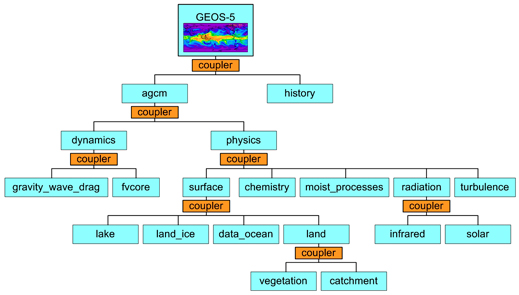

The Earth System Modeling Framework (ESMF) is a suite of software tools for developing high-performance, multi-component Earth science modeling applications. Such applications may include a few or dozens of components representing atmospheric, oceanic, terrestrial, or other physical domains, and their constituent processes (dynamical, chemical, biological, etc.). Often these components are developed by different groups independently, and must be “coupled” together using software that transfers and transforms data among the components in order to form functional simulations.

ESMF supports the development of these complex applications in a number of ways. It introduces a set of simple, consistent component interfaces that apply to all types of components, including couplers themselves. These interfaces expose in an obvious way the inputs and outputs of each component. It offers a variety of data structures for transferring data between components, and libraries for regridding, time advancement, and other common modeling functions. Finally, it provides a growing set of tools for using metadata to describe components and their input and output fields. This capability is important because components that are self-describing can be integrated more easily into automated workflows, model and dataset distribution and analysis portals, and other emerging “semantically enabled” computational environments.

As ESMF has become available and has evolved to be a robust software framework, several groups have been involved in adopting its use in climate and weather prediction models and in data assimilation systems. Existing programs have been converted to use the superstructure of the framework at MIT, NCAR, GFDL, Goddard, NCEP and the DoD (see impacts). 
One of the most complete attempts to use ESMF has been the development of the [GEOS Systems](https://gmao.gsfc.nasa.gov/GEOS_systems/), a model targeted by the [NASA MAP program](https://map.nasa.gov/models/GEOS-5.php). 
The GEOS various applications have been built ‘from the ground up’ using the latest available versions of ESMF superstructure and infrastructure. 
Figure 1 (below) represents a hierarchical (tree) implementation of the component-based GEOS-5 software where each box is an ESMF component performing some specific function and the root of the tree serves as the top level control point.

Figure 1: _Structure of the GEOS-5 atmospheric general circulation model._

All of these efforts have produced much constructive feedback to the ESMF core development team, 
and have helped refine the design and improve the implementation of the framework. 
They have also served to identify the most important directions for future extensions. 
Comparing the various implementations led to two seemingly contradictory conclusions: all implementations 
are different and much of what they do is the same. 
Both conclusions were anticipated, since ESMF is a general framework designed to meet a wide variety of needs. 
This generality is an important strength of the ESMF design, but it also implies that there are many different 
ways of using ESMF - even when performing very simi- lar tasks.
Other observations from this early experience were that each group, within its own 
implementations, repeatedly needed functions that provided higher level functionality than that provided by 
the basic ESMF tools, and that the core methods of ESMF components (__Run__, __Initialize__, and __Finalize__) 
looked very similar in all their implementations.

The MAPL package arose as a response to this early experience, particularly during the design and implementation of GEOS systems. 
It is based on the observation that much of the work done in these initial implementations can be standardized; 
thus, reducing the labor of constructing ESMF applications in the future, as well as increasing their interoperability. 
In its initial implementation, MAPL provides:

- Specific conventions and best practices for the utilization of ESMF in climate models
- A middle-ware layer (between the model and ESMF) that facilitates the adoption of ESMF by climate models.

This enhancement in usability of ESMF must come at the cost of reduced generality. 
To make the framework more usable for our applications, we make assumptions and place requirements on 
the applications that ESMF, with its goal of generality, could not. 
MAPL does this ‘on top of’ ESMF and as a separate layer through which the application uses ESMF for 
some of its functions (although for most things, applications will continue to use ESMF directly). 
We feel that this middle-ware-layer approach is the right way to get the usability and interoperability 
that climate model components require of the framework, without sacrificing ESMF’s generality and extensibility.
